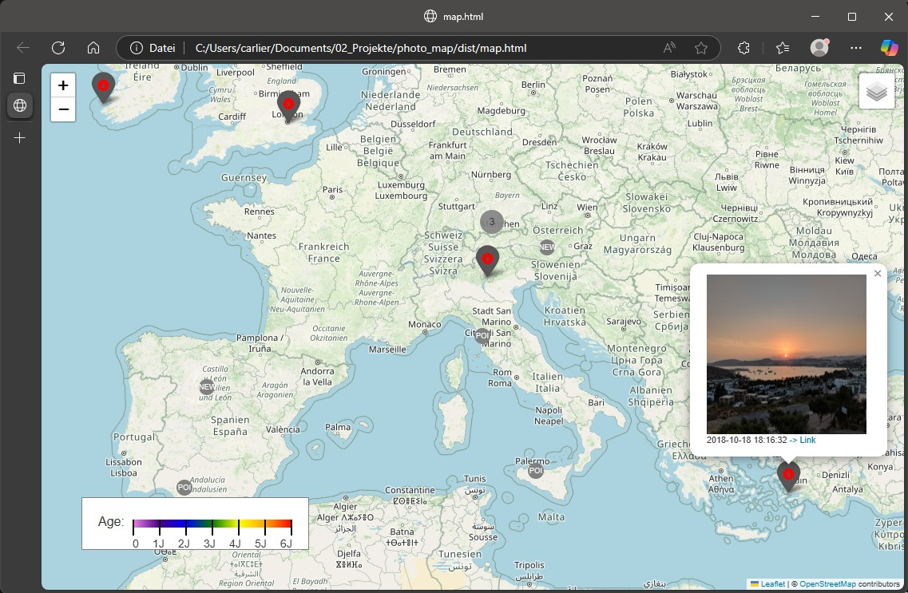

# photo map

photo_map is a a simple console based app to show geotags of photos on a map.

## Use it:
- get [latest release](https://github.com/meindonut/photo_map/releases/latest)
- open *.exe
- copy one ore more folder into console
- optional: create an excel file (see example) to show more information on the map
- open map.html

## Change it:

### Technically:
- uses exifread to get geotags
- optionally loads an excel file for additional makers
- use folium to show the map

Coded in vsode/windows.

### Install required modules in venv

`python -m venv .venv`

`Set-ExecutionPolicy -ExecutionPolicy Bypass -Scope Process -Force # when problems with admin rights`

`.venv/Scripts/activate.ps1`

`pip install -r requirements.txt`

### Build app

`Set-ExecutionPolicy -ExecutionPolicy Bypass -Scope Process -Force # when problems with admin rights`

`.venv/Scripts/activate.ps1 # if not already activated`

`pyinstaller --clean --onefile --add-data "legend.html:." --add-data "custom_marker_cluster.css:." --name photo_map main.py`
